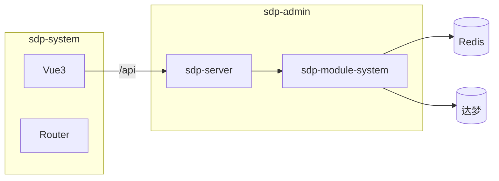

# 《SDP 设计方案》

> 本文档面向 **SDP 管理端（sdp-admin + sdp-system 前端）** 维护人员；未落地能力标注为【规划中】。

---

## 文档地图

| 章节 | 要点 |
|------|------|
| 1 | 模块化分层、前后端职责 |
| 2 | Sa-Token、Redis、Spring Security、登录流程 |
| 3 | RBAC、组织树、种子数据 |
| 4 | 登录审计 |
| 5 | 达梦、MyBatis-Plus、缓存 |
| 6 | API、前端约定 |
| 7 | 安全与上线检查 |
| 8 | 部署运维 |
| 9 | 差距清单 |

---

## 1. 设计思想

后端 Maven 多模块 **sdp-admin**：**sdp-server** （`SdpServerApplication`）为唯一启动模块；**sdp-module-system** 包 `org.nmgyj.authentication`，提供 `/api/auth/login`、`ApiResponse`、`SecurityConfig`（`permitAll()`）、`WebCorsConfig`、`MybatisPlusConfig`（`DbType.DM` 分页）、`SysUser`/`SysLoginLog` 及 Mapper；`@MapperScan` 包含 `org.nmgyj.system.mapper` 但尚无对应类。**sdp-module-business** 仅占位 `Main`。**sdp-common-security**/**sdp-common-mybatis** 主要是 POM 依赖；**sdp-api**/ **sdp-gateway** 为 `packaging=pom` 空壳。根 `pom.xml` 统一 Java 21、Spring Boot 3.2.5、Sa-Token 1.44.0、MyBatis-Plus 3.5.8、达梦 JDBC、flatten 插件处理 `${revision}`。

**扩展原则**：新业务放 `sdp-module-*`；全局 Sa-Token 拦截器建议沉淀 `sdp-common-security`；权限判定必须在服务端落地，前端路由只改善体验。

## 2. 认证与鉴权

**Sa-Token + Redis**：`sa-token-spring-boot3-starter` 与 `sa-token-redis-jackson`，适合集群共享会话。`application-dev.yml` ：`token-name=satoken`，`timeout=86400`，`is-concurrent=true`，`is-share=false`，`token-style=uuid`。登录成功：`StpUtil.login(user.getId())`。

**Spring Security**：无 session、CSRF 关闭、**所有请求 permitAll**，资源访问控制需依赖 **Sa-Token 拦截器/注解**（规划中）。

**登录流程**：`POST /api/auth/login` → 校验用户、`status==1`、密码（BCrypt `$2*` 或明文兼容）→ `sys_login_log` → 返回 `token` 与 `tokenHeaderName`。**登出**：规划中，建议 `StpUtil.logout` 并写 `logType=2`。

## 3. RBAC

现状：`sys_user` 含 `deptId`；无角色/权限/菜单表与接口；前端 `hydrateDefaultMenu` 静态菜单。规划中：用户-角色-权限多对多；组织树；种子数据幂等插入。

## 4. 审计

`AuthService.saveLoginLog` 在服务层写入 `sys_login_log`；无 Servlet Filter/Sa-Token 监听器；异常吞掉以免影响登录主链路。

## 5. 数据与缓存

达梦 + Druid + MyBatis-Plus；mapper XML 路径已配置但仓库无 XML；Redis 存 Sa-Token；dev 配置 Spring Cache Caffeine，注意多级缓存一致性。

## 6. API 与前端

`ApiResponse` ：`code==0` 成功。前端 `Login.vue` 将 token 存 `localStorage`，但 **未统一设置请求头 `satoken`**，需 axios 拦截器补齐。Vite `proxy /api -> 8080`。**动态菜单**：规划中。`SideMenu.vue` 引用 Element Plus 组件，**package.json 缺少 element-plus依赖**。

## 7. 安全与上线

收紧 CORS；敏感配置外置；登录限流/防爆破规划中；生产检查：注册 Sa-Token 拦截器、HTTPS、强口令、禁用 dev profile。

## 8. 部署与运维

顺序：达梦 → Redis → `sdp-server` → 前端。配置：`sdp-server/application*.yml` 与 `sdp-module-system/application.yml` 合并加载。

## 9. 差距清单

| 项目 | 状态 |
|------|------|
| 登录/Token | 已实现 |
| 登出 | 规划中 |
| 全局鉴权 | 规划中 |
| RBAC/API | 规划中 |
| axios satoken | 规划中 |
| sdp-api/gateway | 空壳 |
| element-plus | 待对齐 |

---
